<!--
 * @Author: 33357
 * @Date: 2021-02-05 13:15:37
 * @LastEditTime: 2021-02-06 16:41:48
 * @LastEditors: 33357
-->

# unichat-public

unichat 项目开源信息

## 目录

- [项目背景](#项目背景)
- [项目设计](#项目设计)
- [项目预览](#项目预览)
- [访问项目](#访问项目)
- [相关项目](#相关项目)
- [升级计划](#升级计划)
- [维护成员](#维护成员)
- [加入贡献](#加入贡献)
- [开源协议](#开源协议)

## 项目背景

unichat是一款基于区块链上金融关系而搭建的匿名社交平台，致力于实现以下目标：

- **Token即社群：** unichat将为每一种Token开辟专门的社群，任何拥有该Token的人都能自动加入。

- **Token即身份：** 在unichat，有Token本身就是身份。只要你有Token，没人会在乎你的现实身份，即使对面是一条狗在打字。

- **Token即权利：** unichat中群聊的管理权归Token社区，用户可以使用Token选举管理员、制定规则。

## 项目设计

- **用户登录：** 用户通过其钱包使用私钥对服务器指定信息进行签名，从而服务器验证其为私钥持有者完成登录。

- **社群检索：** 服务器为用户发送 TokenList，用户通过钱包检索其持有的 Token，当余额不为 0 时则加入该 Token 所属社群。

- **社群添加：** 用户主动输入 Token 地址，钱包检索其持有余额是否为 0，当余额不为 0 时则加入该 Token 所属社群。

- **显示Token：** 用户进行聊天时可以看到其他用户的Token余额。

- **验证Token：** 用可以点击其他用户的名片跳转区块链浏览器验证Token余额。

## 项目预览

- **用户登录：**

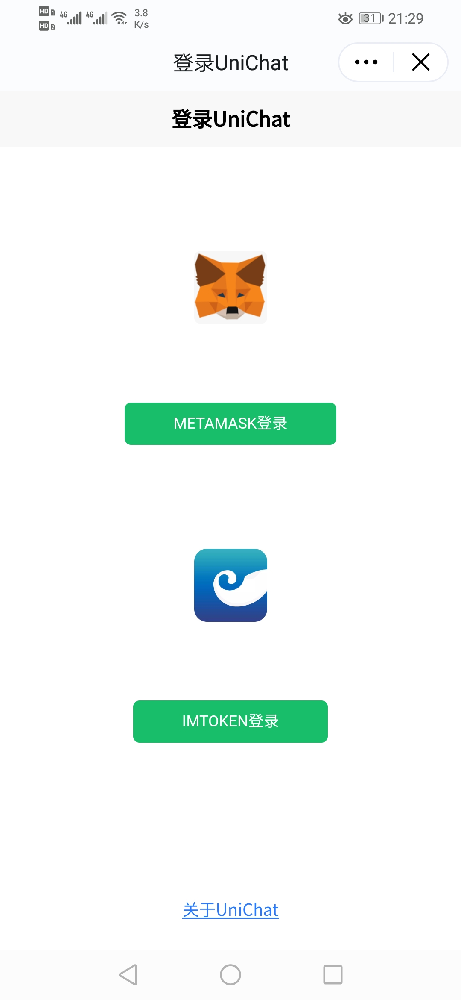->
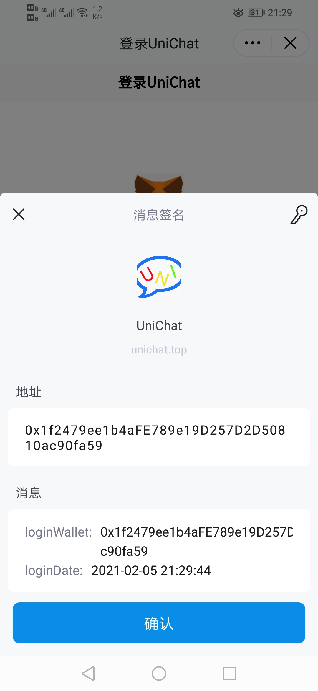->
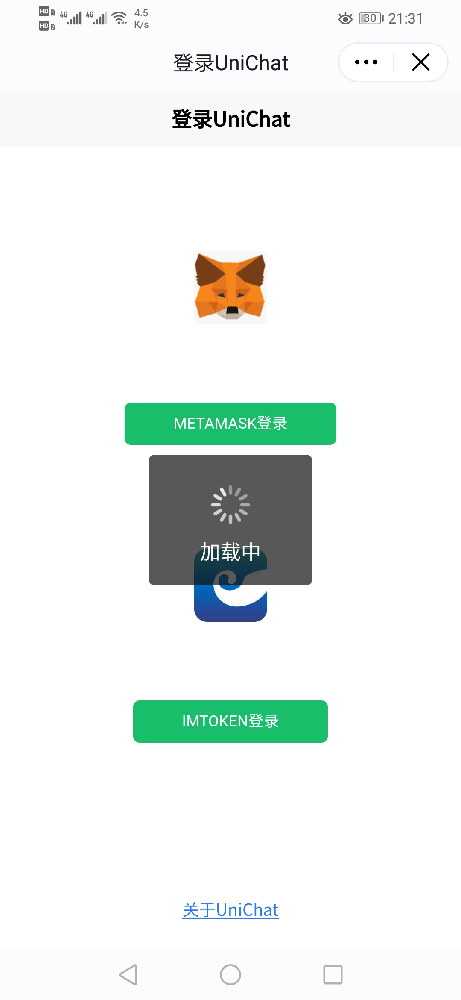

- **社群检索：**

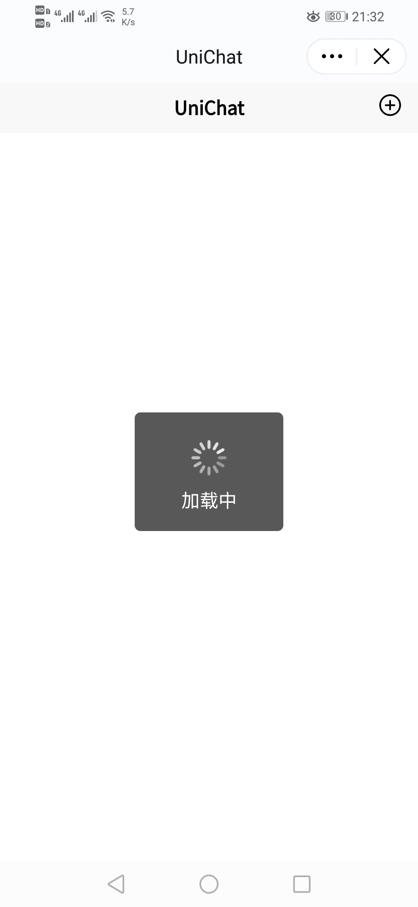->
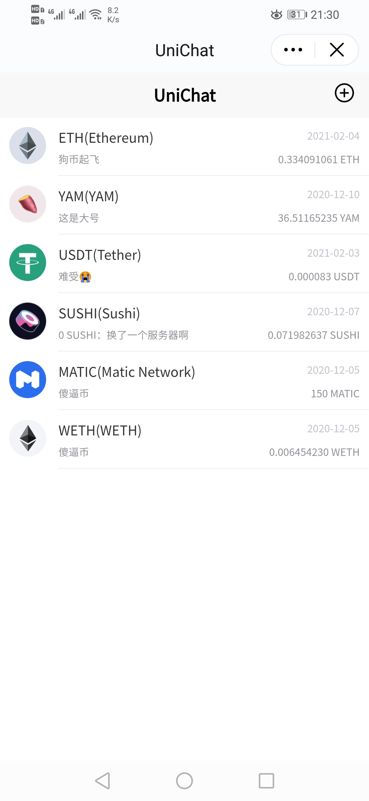

- **社群添加：**

->
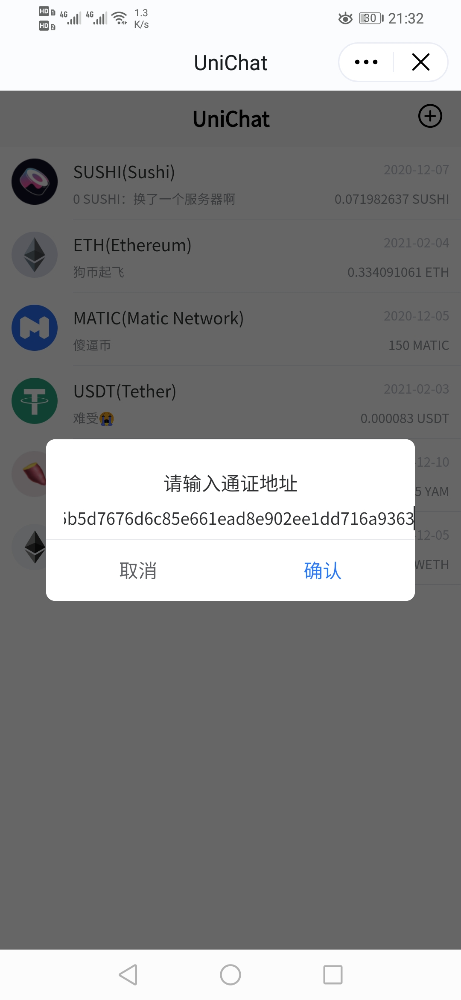->
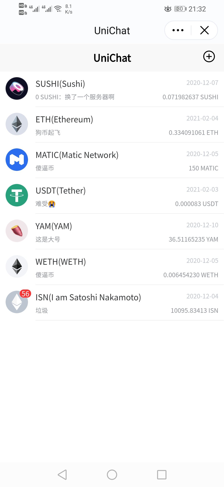

- **显示Token：**

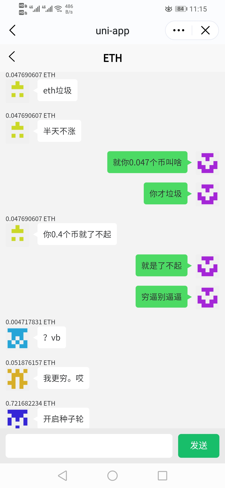->
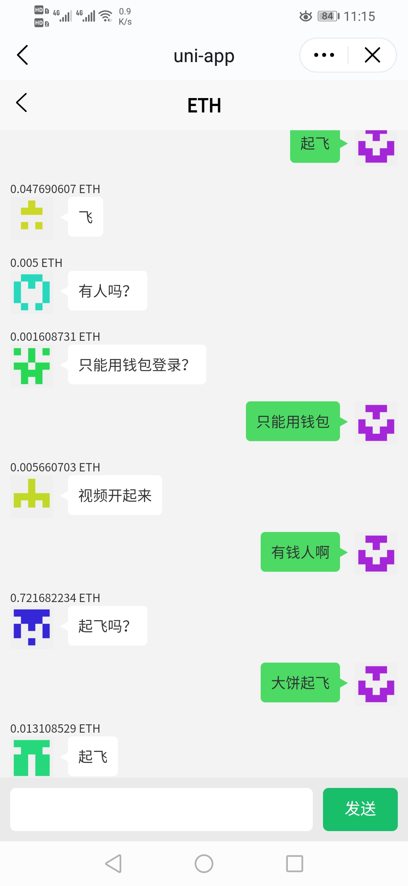

- **验证Token：**

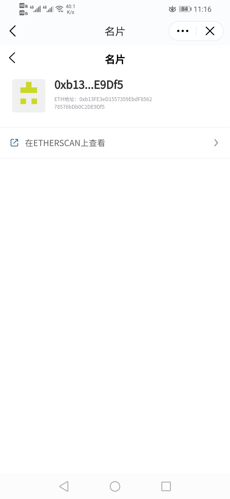->
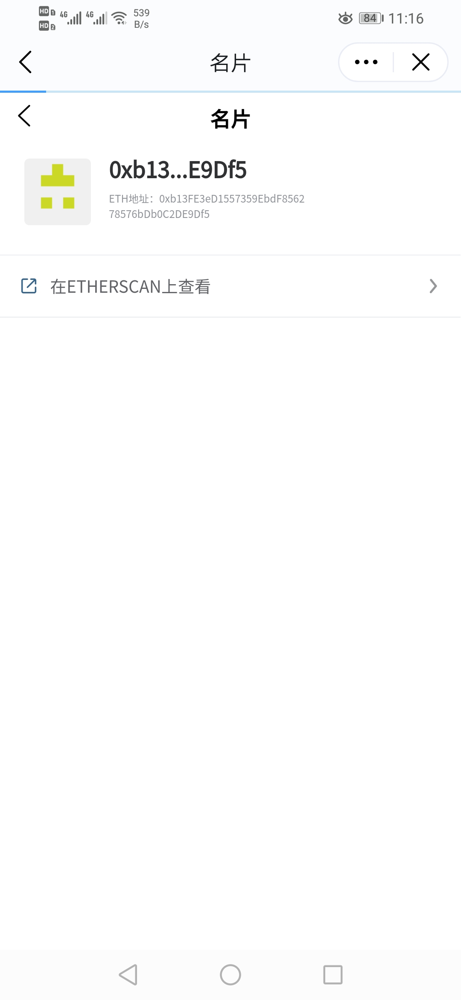->
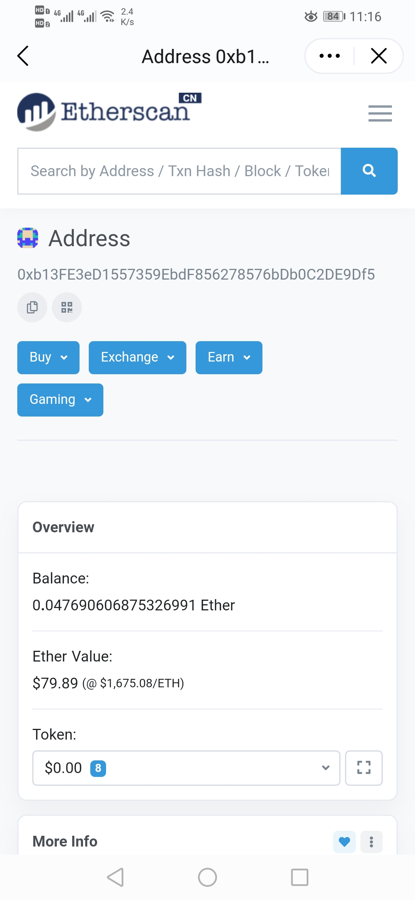

## 访问项目

目前项目部署于：[https://unichat.top](https://unichat.top)

PC端支持Chrome浏览器和MetaMask，移动端支持IMToken。

## 相关项目

- **unichat Server端开源信息：** [unichat-server-public](https://github.com/33357/unichat-server-public)

- **unichat APP端开源信息：** [unichat-app-public](https://github.com/33357/unichat-app-public)

- **unichat 智能合约开源信息：** [unichat-contract-public](https://github.com/33357/unichat-contract-public)

## 升级计划

- **独立APP开发：** 为获得更好的用户体验，并支持更多功能，计划进行脱离钱包支持的独立 APP 开发。

- **去中心化存储：** 为了减少网络波动和不可抗力的影响，计划对用户聊天信息实现去中心化的存储。

- **多链支持：** unichat目标为所有区块链网络用户提供服务，将会对绝大多数的区块链提供服务。

- **链上认证：** 对用户的身份信息进行上链，实现跨账户、跨钱包用户的统一身份认证。

- **通证投票：** 用户使用其通证进行投票，从而使得项目社群生成决议。

## 维护成员

[@33357](https://github.com/33357)

## 加入贡献

因为项目升级计划的原因，暂不支持加入贡献，但欢迎发起讨论。

## 开源协议

[MIT](LICENSE)