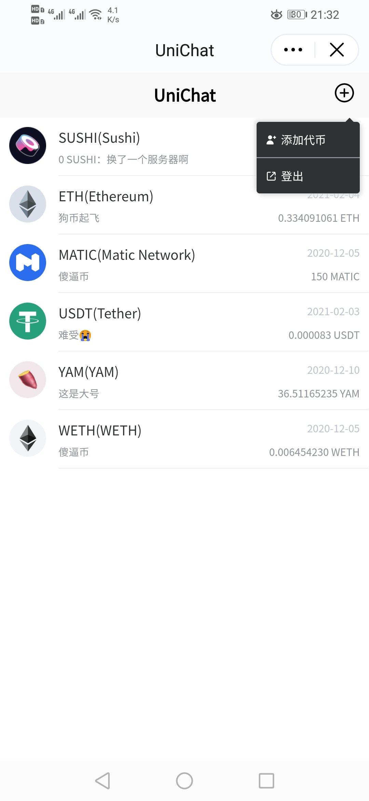

<!--
 * @Author: 33357
 * @Date: 2021-02-05 13:15:37
 * @LastEditTime: 2021-02-05 22:03:13
 * @LastEditors: 33357
-->

# unichat-public

unichat 项目开源信息

## 目录

- [项目背景](#项目背景)
- [项目设计](#项目设计)
- [项目预览](#项目预览)
- [访问项目](#访问项目)
- [相关项目](#相关项目)
- [升级计划](#升级计划)

## 项目背景

unichat 是一款基于区块链上金融关系而搭建的匿名社交平台，致力于实现以下目标：

- **社群自建：**
  区块链项目的社群建立不依靠该项目开发组的支持

- **社群自治：**
  区块链项目的社群管理不依靠该项目开发组的支持

- **信息共享：**
  区块链项目的社群不能拒绝任何其 Token 的持有者加入并获取其中信息

## 项目设计

- **用户登录：** 用户通过其钱包使用私钥对服务器指定信息进行签名，从而服务器验证其为私钥持有者完成登录。

- **社群检索：** 服务器为用户发送 TokenList，用户通过钱包检索其持有的 Token，当余额不为 0 时则加入该 Token 所属社群。

- **社群添加：** 用户主动输入 Token 地址，钱包检索其持有余额是否为 0，当余额不为 0 时则加入该 Token 所属社群。

## 项目预览

- **用户登录：**

->
->

- **社群检索：**

->

- **社群添加：**

->
->

## 访问项目

目前项目部署于：[https://unichat.top](https://unichat.top)

## 相关项目

- **unichat 服务器端开源信息：** [unichat-server-public](https://github.com/33357/unichat-server-public)

- **unichatAPP 端开源信息：** [unichat-app-public](https://github.com/33357/unichat-app-public)

- **unichat 智能合约开源信息：** [unichat-contract-public](https://github.com/33357/unichat-contract-public)

## 升级计划

- **独立 APP 开发：** 为获得更好的用户体验，并支持更多功能，计划进行脱离钱包支持的独立 APP 开发。

- **去中心化存储：** 为了减少网络波动和不可抗力的影响，计划对用户聊天信息实现去中心化的存储。

- **多链支持：** unichat 目标为所有区块链网络用户提供服务，将会对绝大多数的区块链提供服务。

- **链上认证：** 将会对用户的身份信息进行上链，实现跨账户、跨钱包用户的统一身份认证。
